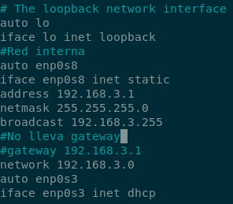
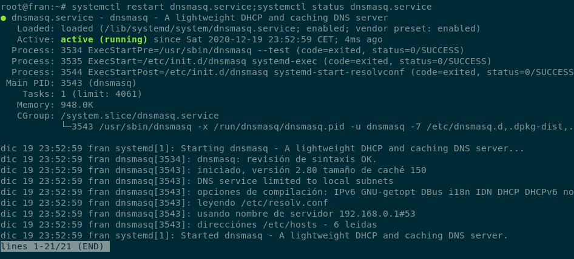

# 2.- Instalación

## Configuración en el Servidor
Configuración de red:

Reiniciamos el servicio

``systemctl restart networking``

Instalamos DNS dnsmasq:

``apt install dnsmasq``

Activamos el servicio, reiniciamos y comprobamos estado:

``systemctl enable dnsmasq;systemctl start dnsmasq;systemctl status dnsmasq``

Copia de seguridad del fichero:

``cp /etc/dnsmasq.conf /etc/dnsmasq.conf.ORIGINAL``

Ejecutamos los siguientes comandos:

``echo "server=/fran.com/192.168.1.1" >> /etc/dnsmasq.conf``

``echo "local=/fran.com/" >> /etc/dnsmasq.conf``

Reiniciamos y vemos el estado del servicio:

``systemctl restart dnsmasq.service;systemctl status dnsmasq.service``

Usaremos el archivo /etc/hosts como "Base de datos" para los dominios.
Fichero /etc/hosts (añadimos la informacion del cliente y el servidor)

## Configuraciones en el cliente
En el cliente pondremos la IP que habiamos indicado anteriormente en /etc/hosts en el servidor. cambiaremos los dns con la ip del servidor.

________________________________________
*[Volver al indice...](../README.md)*