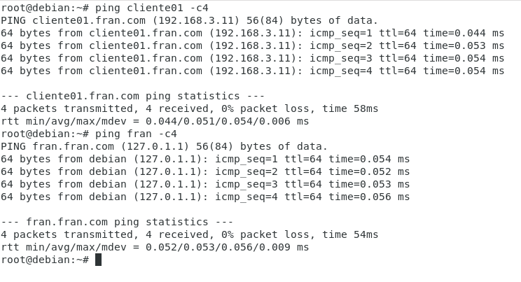

# 3.- Pruebas
## Comandos para pruebas

``dig cliente01``

``dig fran``

``dig -x 192.168.3.1``

``dig -x 192.168.3.11``

## Pruebas de ping

________________________________________
*[Volver al indice...](../README.md)*

